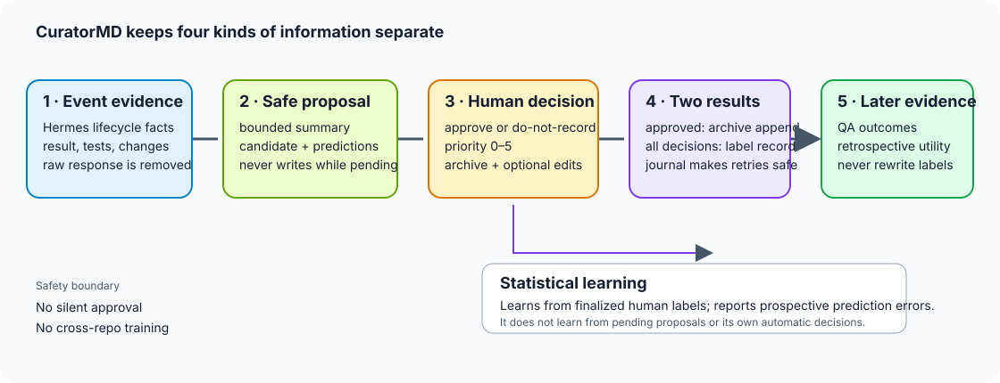
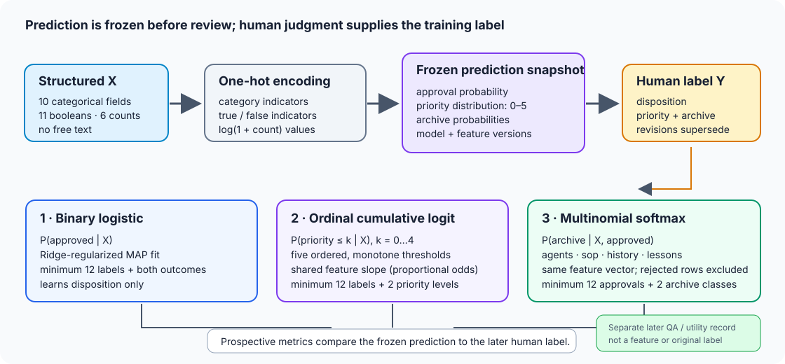
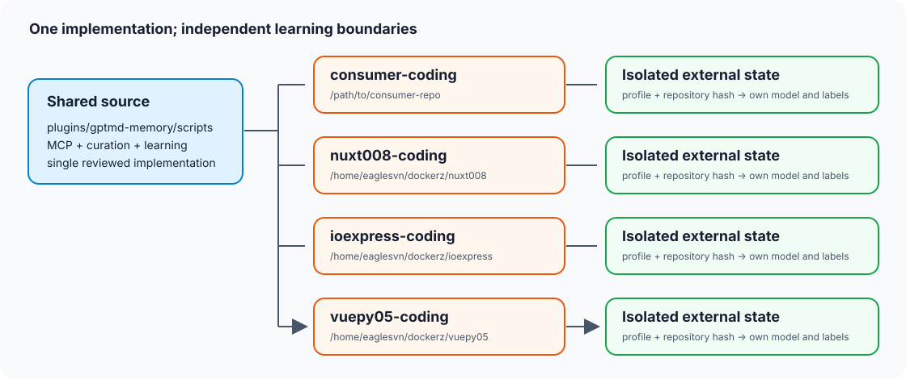

# CuratorMD user guide

CuratorMD is the local, human reviewed knowledge and learning layer for a
project. It turns selected Hermes lifecycle evidence into a bounded proposal,
asks a person to decide what belongs in the project chronicle, writes approved
entries to `persistence/*.md`, and measures how later proposals compare with
human decisions.

The implementation lives in the [`gptmd-memory` plugin](../plugins/gptmd-memory/README.md).
This guide describes the current code. The [learning plan](curation-learning-PLAN4.md)
contains future analysis and automation design too; features called future or
not implemented below are not implied to exist because they appear in that plan.

## What you get

- A small, redacted review card instead of a raw session transcript.
- A consistent choice set: approve or do not record, priority 0–5, and one of
  `agents`, `sop`, `history`, or `lessons` for approved entries.
- Idempotent archive writes with a durable recovery journal. Retrying a review
  does not append a second copy.
- An explicit audit of what the model proposed and what the human selected.
- After enough reviews, advisory probabilities based on this profile and this
  repository's own decisions.
- Prospective metrics that show how frozen proposals compared with later human
  labels, plus separate QA and usefulness summaries.
- Independent state per Hermes profile and Git worktree. No repository borrows
  another repository's labels or model.

The expected day to day benefit is less time reconstructing events and more
consistent review. Once labels accumulate, the probabilities can help order or
triage proposals and reveal where the model routinely needs correction. They
are suggestions: no approval, rejection, archive edit, or commit is automatic.

At the current rollout, each deployed profile has zero finalized learning
observations. You will get safe proposals and explicit review immediately;
personalized model improvement and meaningful scorecards begin only after
humans finalize examples. CuratorMD does not claim a measured reduction in work
or an accuracy gain before those data exist.

## Flow and trust boundaries



### What “bounded, redacted proposal” means

1. The profile observer captures a limited Hermes event envelope. It includes
   event identity and structured result facts when available. The hook is
   best-effort and does not block the agent.
2. Before persistence redaction, `safe_summary()` chooses a producer supplied
   safe summary, builds a sentence from structured result fields, or extracts
   the first sentence of the response as a fallback. The result is sanitized
   and capped at 1,200 characters.
3. Top-level `response` and `message` fields are replaced with `[REDACTED]`.
   Secret-like values are scrubbed from remaining values and sensitive keys
   are redacted. The entire serialized payload is capped at 24,000 bytes.
4. Candidate text is derived from the safe summary. The title is capped at 120
   characters. A pending candidate is never written to canonical knowledge.
5. The review tool returns no raw response or prompt. Only a finalized human
   approval can append to one of the four persistence files.

Redaction is a bounded local sanitizer, not a general personal-data detector.
Do not put secrets, personal details, credentials, or confidential source
material in a producer supplied summary. Unredacted responses are not retained
as a recovery source.

The observer currently receives summary/result fields only if Hermes supplies
them in its event context. If no useful summary or structured facts are
available, CuratorMD leaves the record ambiguous rather than inventing a
candidate.

## Review a proposal

Use the explicit absolute Git worktree root on every MCP call. A typical
sequence is:

```text
curation_run(project_root, profile)
curation_pending(project_root, profile)
curation_review(project_root, record_id, disposition, priority, archive, profile)
persistence_status(project_root, profile)
```

The pending response contains the record ID, event type, capture time, safe
summary, candidate, proposal, and current selections. Review only what it
returns; it deliberately excludes raw event responses.

Choose:

- `disposition`: `approved` or `do-not-record`.
- `priority`: integer 0–5. Priority 5 requires `confirm_priority_5: true`.
- `archive`: required for approval; omit for `do-not-record`.
- `edits`: optional changes to `title`, `content`, `utility`, or `impact`.

Pending records remain editable and retryable. Routine `agent:start` and
`agent:step` events are suppressed. A finalized decision can be corrected by
creating a new review revision. The prior learning observation becomes
inactive and remains in the audit history. Revisions correct labels; candidate
text is immutable after finalization.

## MCP tool reference

The stdio MCP server is named `curatormd`. Every tool requires `project_root`
except that some also take a `profile`. The root must be absolute, resolve to a
Git worktree root, and contain `persistence/`.

| Tool | Inputs | Result and use |
| --- | --- | --- |
| `memory_recall` | `project_root`, `query`; optional `scope`: `all`, `agents`, `sop`, `history`, `lessons` | Search durable project knowledge. |
| `persistence_status` | `project_root`; optional `profile` | Persistence-file health, scoped Git state, inbox count, capture state, learning phase, and external state location. |
| `environment_snapshot` | `project_root` | Read approved repository metadata and persistence health; never reads `.env` values. |
| `native_projection_record` | `project_root`, `source_id`, `event_type`, `payload`; optional `cursor`, `profile` | Store one bounded redacted event in the ignored native inbox. Identical captures are idempotent. |
| `curation_run` | `project_root`; optional `schedule_slot`, `profile` | Recover interrupted review transactions, form candidates, keep pending records pending, recompute if due, and prune matured external data. |
| `curation_pending` | `project_root`; optional `profile`, `limit` (1–100, default 30) | Return pending summaries and candidates without raw response fields. |
| `curation_review` | `project_root`, `record_id`, `disposition`, `priority`; optional `archive`, `confirm_priority_5`, `edits`, `profile` | Finalize or revise a human decision. Approval journals and appends one archive entry; rejection does not create a new archive entry. |
| `learning_status` | `project_root`; optional `profile` | Phase, active row count, model fit status, latest version, and next scheduled recomputation. |
| `learning_recompute` | `project_root`; optional `profile`, `force` | Refit models and regenerate the report. Normal scheduling is at most once per 21 days; `force` bypasses that interval. |
| `learning_report` | `project_root`; optional `profile` | Read the latest prospective metrics, corrections, sample counts, QA counts, and automation status. |
| `qa_outcome_record` | `project_root`, `record_id`, `outcome_type`, `window_days` (30/60/90/180), `finalize_window`; optional scalar `value`, bounded `evidence`, `profile` | Record a human checked later outcome separately from the original label. Finalize a window only after checking that horizon. |
| `retrospective_review` | `project_root`, `record_id`, `still_correct` (`yes`/`no`/`uncertain`), `usefulness` (0–4), `germane` (`yes`/`superseded`/`obsolete`/`uncertain`); optional `should_have_recorded`, `profile` | Record a later human assessment of continuing correctness and utility. |
| `persistence_record` | `project_root`, `kind`, `title`, `content`; optional `rationale`, `impact`, `profile` | Append a reviewed project decision, procedure, rule, or lesson with a stable marker. |
| `self_improvement_capture` | `project_root`, `failure`, `cause`, `fix`, `prevention`; optional `profile` | Append a bounded verified failure and prevention lesson. |

MCP supports `initialize`, `tools/list`, and `tools/call` over stdio. A tool
error is returned as a JSON-RPC error and does not terminate the server loop.
The tool schemas are the authoritative parameter validation surface in
[`mcp_server.py`](../plugins/gptmd-memory/scripts/mcp_server.py).

## Command line interface

The CLI in [`gptmd_memory.py`](../plugins/gptmd-memory/scripts/gptmd_memory.py)
accepts `--project-root` and optional `--profile` before the subcommand:

```bash
python3 plugins/gptmd-memory/scripts/gptmd_memory.py \
  --project-root /absolute/path/to/repo --profile repo-coding status

python3 plugins/gptmd-memory/scripts/gptmd_memory.py \
  --project-root /absolute/path/to/repo --profile repo-coding pending-reviews

python3 plugins/gptmd-memory/scripts/gptmd_memory.py \
  --project-root /absolute/path/to/repo --profile repo-coding learning-status

python3 plugins/gptmd-memory/scripts/gptmd_memory.py \
  --project-root /absolute/path/to/repo --profile repo-coding learning-report

python3 plugins/gptmd-memory/scripts/gptmd_memory.py \
  --project-root /absolute/path/to/repo --profile repo-coding learning-recompute --force
```

The CLI also exposes `snapshot`, `search`, `record`, `observe`, `curate`,
`review`, and `improve`. QA outcome and retrospective entry points are currently
MCP-only.

## Learning data and training rules



Learning data is stored outside Git under the effective Hermes home:

```text
~/.hermes/PLUGIN_DATA/curatormd/<profile>/<sha256-of-worktree-prefix>/learning/
  observations/ predictions/ models/ reports/ qa-outcomes/
  retrospective-audits/ transactions/ locks/
```

`HERMES_HOME` or `CURATORMD_PLUGIN_DATA` can change the base directory. The
project root is resolved before hashing; each profile/root pair has a distinct
namespace. Models are deterministic local Python code and require no remote
service or third party numerical package.

| Rule | Current behavior |
| --- | --- |
| Label source | Only finalized human reviews (`review_source = human`). Pending proposals and machine decisions are not labels. |
| Revisions | Only the latest active revision trains. Earlier revisions remain auditable and are excluded. |
| Active window | 183 days (approximately six months). |
| Maximum fit size | Most recent 2,500 eligible observations. |
| Refit interval | 21 days unless explicitly forced. |
| Event retention | At least 274 days (approximately nine months); older rows are held until all four QA windows and the retrospective review are finalized. |
| Prediction history | First pre-review snapshot per record is immutable. A revision changes the active label; it does not rewrite the prediction. |
| Free text | Summary prose, response text, candidate text, reviewer edits, QA evidence, and retrospective outcomes are excluded from predictor features. |
| Automation | Always off in the current implementation. Human review remains required regardless of score. |

For each new candidate, the snapshot stores predictor features, prediction
distributions, model version, feature version, proposal, timestamp, and
`automation.enabled: false`. An existing snapshot is returned unchanged.

## Statistical components, in detail


### Feature vector

The current vector has these structured fields:

| Type | Fields | Encoding |
| --- | --- | --- |
| Categorical (10) | `event_type`, `provider`, `profile`, `model`, `platform`, `scope`, `activity_class`, `status`, `result_class`, `failure_class` | One-hot indicators; `unknown` and `__OTHER__` categories are available. |
| Boolean (11) | project changed, decision made, configuration/dependency/interface/architecture/documentation/security/data changed, tests executed, safe summary available | One-hot `true`/`false`. |
| Counts (6) | tests passed/failed/skipped, files changed, errors, tool count | Nonnegative `log(1 + count)` values. |

There is an intercept. No words, embeddings, candidate text, user-edited prose,
review rationale, or later QA values enter `X`. Booleans are currently mapped
to false for any non-`true` value; producers should therefore supply actual
booleans where evidence exists. Missing categorical values map to `unknown`.

### 1. Approval model: ridge-regularized binary logistic regression

For each reviewed row, `y=1` means approved; `y=0` means do-not-record. The
model estimates:

$$
p_i = P(y_i=1 \mid x_i) = \sigma(\beta_0 + x_i^T\beta),\qquad
\sigma(z)=\frac{1}{1+e^{-z}}.
$$

The fitted coefficients minimize average binary cross-entropy plus an L2
penalty on non-intercept coefficients. In the code, the gradient is averaged
over rows, the learning rate is `0.12`, the ridge coefficient is `0.8`, and
optimization stops after at most 320 iterations or when the largest parameter
step is below `1e-7`. The intercept is not penalized.

Fit only when there are at least 12 eligible labels and both dispositions are
present. Otherwise the reported model status is `insufficient_support` and
the prediction is the smoothed base rate:

$$
\hat p = \frac{n_{approved}+1}{n+2}.
$$

With no trained model file, the initial probability is `0.5`. Candidate text
uses a threshold of `p ≥ 0.5` to display a suggested disposition. The tie
threshold is a proposal convention, not evidence that an event is valuable.

### 2. Priority model: proportional-odds cumulative logistic regression

Priority is ordered from 0 through 5. The model estimates five cumulative
probabilities:

$$
P(Y \leq k \mid x) = \sigma(\theta_k - x^T\beta),\qquad k=0,1,2,3,4.
$$

The six class probabilities are recovered by differences between adjacent
cumulative probabilities; class 5 is one minus the last cumulative
probability. The thresholds must be increasing. They are parameterized as
`theta[0] = theta0` and `theta[k] = theta[k-1] + exp(delta[k])`, which enforces
ordering during optimization. All thresholds share the same coefficient
vector (the proportional-odds assumption).

The initialization uses Laplace-smoothed cumulative class frequencies. The
optimizer uses learning rate `0.025`, ridge coefficient `0.6`, a maximum of
700 iterations, and a stopping step threshold of `2e-6`. The fit requires at
least 12 labels and at least two distinct priority values. Otherwise it
returns add-one smoothed class frequencies. When there is no model bundle, the
proposal uses uniform probabilities and displays priority 1.

### 3. Archive model: ridge-regularized multinomial softmax

This model is fit only on approved rows with a finalized archive label. The
four classes are `agents`, `sop`, `history`, and `lessons`; rejected rows are
not negative examples for any archive. For class `c`:

$$
P(Y=c \mid x, approved) =
\frac{\exp(w_c^T x)}{\sum_j \exp(w_j^T x)}.
$$

It minimizes average multiclass cross-entropy plus L2 regularization on
non-intercept weights. The code uses learning rate `0.08`, ridge coefficient
`0.9`, at most 360 iterations, and a stopping step threshold of `1e-7`. It
requires at least 12 approved labeled rows and at least two archive classes.
Otherwise the model reports add-one smoothed class frequencies; before any
model bundle, archive probabilities are uniform and the proposal falls back to
`history` (or `lessons` for a failure/partial/blocked result).

### Recompute, evaluation, and safeguards

The daily curator checks the model timestamp and recomputes no more frequently
than every 21 days. A manual `learning_recompute(force: true)` can request an
immediate fit. Each fit:

1. selects active, eligible, human-reviewed observations from the latest 183
   days and caps them at 2,500;
2. uses only the features frozen from the original event;
3. trains the three models under their own target eligibility rules;
4. writes a versioned model, then atomically replaces the latest model pointer
   and report. Each file replacement is atomic on its own; the three-file
   update is not one cross-file transaction;
5. keeps automation disabled.

The report scores only snapshots whose `predicted_at` timestamp precedes the
human review timestamp. This is prospective evaluation, not a random train/test
split. Approval metrics are log loss, Brier score, accuracy, precision, recall,
false rejection rate, and five probability calibration bins. Priority metrics
are exact agreement, agreement within one point, mean absolute error, and
signed bias. Archive metrics are accuracy and log loss on approved rows only.
Correction rates report how often humans changed disposition, priority,
archive, or text.

| Report field | Exact calculation |
| --- | --- |
| Approval log loss | Mean `-[y log(p) + (1-y) log(1-p)]`; probabilities are clipped to `[10^-12, 1-10^-12]` for the logarithms. Lower is better. |
| Approval Brier score | Mean `(p-y)^2` for the approval probability. Lower is better; the range is 0–1. |
| Approval accuracy | `(true approvals + true do-not-record decisions) / prospective count`, classifying approval at `p ≥ 0.5`. |
| Approval precision | `true approvals / all predicted approvals`; null if no record is predicted approved. |
| Approval recall | `true approvals / all human-approved records`; null if there are no human approvals. |
| Approval false rejection rate | `false rejections / all human-approved records`, the complement of recall when the denominator exists. A false rejection is an approved record with `p < 0.5`. |
| Calibration bins | Five fixed probability intervals `[0,.2)`, `[.2,.4)`, `[.4,.6)`, `[.6,.8)`, `[.8,1]`; each reports count, mean predicted probability, and observed approval rate. |
| Priority exact / within-one agreement | Fraction of prospective rows where the highest-probability priority equals the human score / differs by at most one. Ties select the lower priority. |
| Priority MAE / signed bias | Mean absolute `predicted priority - human priority` / mean signed difference. Positive bias means scores trend higher than human selections. |
| Archive accuracy / log loss | Correct top-probability archive fraction / mean negative log probability of the human archive, using approved rows only. |
| Correction rates | Fraction of prospective rows where the human changed the corresponding proposed disposition, priority, or text; archive correction uses approved rows only. These measure edit frequency, not model quality by themselves. |

All rates include their relevant sample count (`prospective_prediction_count`
or `archive_sample_count`). A `null` metric means its denominator is zero.
These formulas describe the current implementation and do not imply a
statistical uncertainty estimate.

This implementation does not calculate confidence intervals or posterior
credible intervals, p-values, causal effects, a champion/challenger comparison,
or a feature-drift test. Calibration bins are descriptive and may be unstable
with small counts. The fit thresholds prevent fitting below basic support;
they do not establish reliability. The report must be read with its sample
counts and `insufficient_support` statuses.

### Later project-quality outcomes are separate

`qa_outcome_record` accepts a human checked outcome type, a 30/60/90/180 day
window, a scalar value, bounded evidence, and an optional window-finalized
flag. QA is summarized by outcome type and window. `retrospective_review`
stores a later human judgment of correctness, usefulness (0–4), germane status,
and whether the event should have been recorded. Reports currently provide
counts and mean retrospective usefulness. Neither source is fed back into the
original disposition, priority, or archive models.

These are observational records. They cannot prove that a curation choice
caused a regression, recovery, or time saving. The future plan describes richer
association, drift, and prospective automation gates; those analyses and
Phase 2/3 automated decisions are not implemented. Do not interpret a good
historical score as authorization to automate.

## Function reference

Public interfaces are the MCP tools above and the CLI commands. The Python
functions below explain where that behavior lives. Names beginning with `_`
are internal implementation details; they are documented for operators and
maintainers, not as a stable external API.

### `curation_learning.py`

| Function | Responsibility |
| --- | --- |
| `learning_root(root, profile)` | Resolve the isolated external learning directory. |
| `_json_read(path, default)` / `_write(path, value)` | Read validated JSON or atomically write private JSON state. |
| `_record_path(root, profile, collection, record_id)` | Resolve a sanitized record filename and create its private collection directory. |
| `update_observation(root, profile, path, update)` | Apply a serialized observation update under an external file lock. |
| `_bounded_text(value, limit)` | Redact and cap text before it can enter a summary. |
| `safe_summary(payload)` | Select, construct, or extract the bounded pre-redaction summary. |
| `extract_features(record)` | Project structured evidence to the fixed, text-free predictor schema. |
| `meaningful(record)` | Decide if evidence merits a candidate; return the decision reason. |
| `_vector(features, vocabulary)` / `_vocabulary(rows)` | Encode the fixed feature map as deterministic numeric vectors. |
| `_sigmoid(value)` / `_dot(a, b)` | Numerically bounded logistic transform and vector dot product. |
| `_fit_binary(rows, vectors, target)` | Fit approval logistic regression or return a smoothed prior. |
| `_fit_ordinal(rows, vectors)` | Fit the ordered priority model or return smoothed class priors. |
| `_fit_softmax(rows, vectors, target, classes)` | Fit the approved-only archive classifier or return priors. |
| `_predict_binary(model, vector)` / `_predict_ordinal(model, vector)` / `_predict_softmax(model, vector)` | Turn a fitted model or its fallback prior into normalized probabilities. |
| `predict(root, profile, record)` | Load the active models and produce this record's three pre-review distributions. |
| `snapshot(root, profile, record, proposal)` | Persist or retrieve the immutable per-record prediction snapshot. |
| `_active_rows(root, profile, now)` | Select latest active eligible human labels inside the training window and row cap. |
| `_metrics(root, profile, rows)` | Compare frozen pre-review predictions with current active human labels. |
| `_qa_summary(root, profile)` | Aggregate later QA and retrospective counts without joining them into model features. |
| `recompute(root, profile, force)` | Train eligible models, write the versioned model bundle and report, and keep automation off. |
| `status(root, profile)` / `_next_due(value)` | Report phase, sample support, model statuses, and next normal refit time. |
| `report(root, profile)` | Read the latest report or a phase-0 empty report. |
| `save_observation(root, profile, observation)` | Save one immutable review observation; conflict if an ID is reused with different data. |
| `record_qa_outcome(root, profile, record_id, outcome)` | Store an idempotently keyed later QA outcome. |
| `record_retrospective(root, profile, record_id, review)` | Store one retrospective review revision idempotently. |
| `prune(root, profile, now)` | Remove event records only after age and maturity conditions are satisfied. |

### `gptmd_memory.py`

| Function group | Functions and responsibility |
| --- | --- |
| Time and validation | `utc_now`, `iso_now` format timestamps; `clean`, `reject_secrets`, `redact_text`, and `redact_payload` validate or sanitize data; `canonical_json` and `sha256_text` provide stable serialization and IDs. |
| Project boundary | `_run_git` runs bounded Git queries; `resolve_project_root` requires an absolute worktree root with `persistence/`; `store_paths`, `_safe_relpath`, `_file_metadata`, `_approved_manifest_metadata`, `_persistence_health`, and `_git_state` inspect only approved paths; `environment_snapshot` assembles safe project metadata. |
| State and durability | `_plugin_data_root`, `_state_path`, `_load_state`, `_atomic_json`, `_create_json_once`, `_save_state`, `_inbox_dir`, and `_cleanup_inbox` maintain isolated, private, retry-safe state. |
| Capture and archives | `native_projection_record` stores a redacted capture; `_knowledge_conflict` detects user edits or merge markers; `_atomic_text` replaces a document durably; `_append_reviewed` adds one stable record marker; `curation_lock` serializes repository writes; `_load_inbox` and `_record_path` load pending records. |
| Proposal and review transaction | `_candidate_for` creates the safe candidate and snapshot; `_observation_for` separates AI proposal from human label; `_apply_transaction`, `_finalize_review`, and `_recover_transactions` make finalization recoverable; `review_candidate` validates a human review or correction revision; `curate` processes inbox state, recovers journals, recomputes when due, and prunes matured rows. |
| User operations | `search` searches persistence files; `status` reports health and state; `append_entry` records a reviewed durable entry; `learning_status`, `pending_reviews`, `learning_recompute`, `learning_report`, `qa_outcome_record`, and `retrospective_review` expose the learning workflow; `self_improvement` records a verified lesson; `main` parses the CLI. |

### Transport, profile setup, and hooks

| Module/function | Responsibility |
| --- | --- |
| `mcp_server.reply` | Encode one JSON-RPC response. |
| `mcp_server.call_tool` | Validate the root and dispatch a tool call to its implementation. |
| MCP request loop | Handle initialization, tool discovery, and tool calls over stdio. |
| `enable_repo.command_text` / `run` | Execute Hermes setup commands, with a dry-run path. |
| `enable_repo.ensure_curatormd_mcp` | Reconcile the named profile's MCP server to the shared code path and explicit profile identity. |
| `enable_repo.ensure_profile_skills` | Install or update both CuratorMD skills atomically and idempotently in the profile. |
| `enable_repo.repo_root` / `profile_names` | Validate a worktree and enumerate existing Hermes profiles. |
| `enable_repo.write_if_missing` / `scaffold_knowledge` | Create only missing onboarding contract files and ignored inbox configuration. |
| `enable_repo.daily_expression` / `main` | Calculate a staggered schedule and orchestrate repository onboarding. |
| `install_hermes_integration.atomic_write` | Write profile hook and cron files atomically with private permissions. |
| `handler_source` / generated `_source_id` / generated `handle` | Build a profile-bound observer that captures only selected lifecycle events and never blocks Hermes. |
| `cron_source` / `install_hermes_integration.main` | Generate and install the one-project daily curator runner. |

The [`gptmd-memory` skill](../plugins/gptmd-memory/skills/gptmd-memory/SKILL.md)
describes the general CuratorMD workflow. The
[`curation-learning` skill](../plugins/gptmd-memory/skills/curation-learning/SKILL.md)
describes pending review, model reports, and later QA entry.

## Deployment and repository isolation



The [`enable_repo.py` onboarding command](../plugins/gptmd-memory/scripts/enable_repo.py)
registers the shared local MCP server, sets `HERMES_PROFILE` explicitly,
installs both profile skills, and generates profile-bound observer and cron
files. Rerunning with the same root/profile/source is idempotent. The code can
be shared; the state cannot. No model or review label is copied between
repositories.

CuratorMD writes canonical knowledge only after explicit review. It never
commits, pushes, deploys, migrates, or deletes application data. Keep
`.curatormd/native-inbox/` ignored and uncommitted.

## Current limits at a glance

- Model fitting is not automatic decision making.
- Small samples return smoothed priors and an `insufficient_support` status.
- The current QA report is descriptive counts and mean retrospective
  usefulness, not causal attribution.
- Confidence intervals, drift detection, champion/challenger evaluation,
  phase-transition analysis, and Phase 2/3 automation are not implemented.
- Review correction can revise labels but does not rewrite the original frozen
  proposal. Canonical approved entries remain an audit of what was recorded.
- Current deployed repositories have no finalized labels yet; their statistical
  benefits will appear only after review data accrues.
